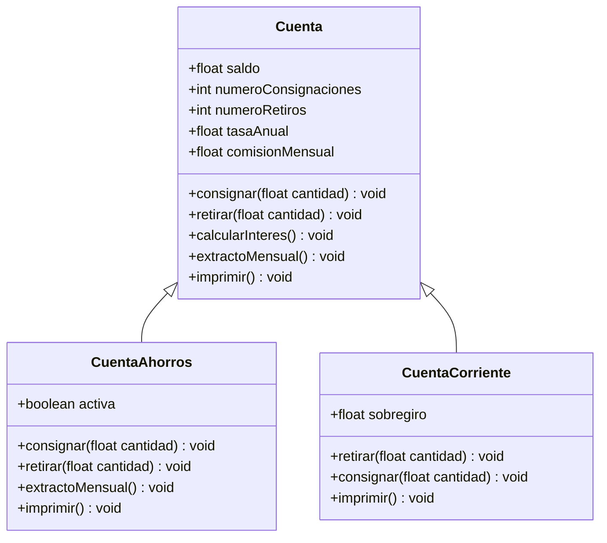

# Proyecto Cuenta

##*Diagrama de Clases*

```mermaid
classDiagram
    class Cuenta {
        +float saldo
        +int numeroConsignaciones
        +int numeroRetiros
        +float tasaAnual
        +float comisionMensual
        +consignar(float cantidad) void
        +retirar(float cantidad) void
        +calcularInteres() void
        +extractoMensual() void
        +imprimir() void
    }
    class CuentaAhorros {
        +boolean activa
        +consignar(float cantidad) void
        +retirar(float cantidad) void
        +extractoMensual() void
        +imprimir() void
    }
    class CuentaCorriente {
        +float sobregiro
        +retirar(float cantidad) void
        +consignar(float cantidad) void
        +imprimir() void
    }
    Cuenta <|-- CuentaAhorros
    Cuenta <|-- CuentaCorriente
```

